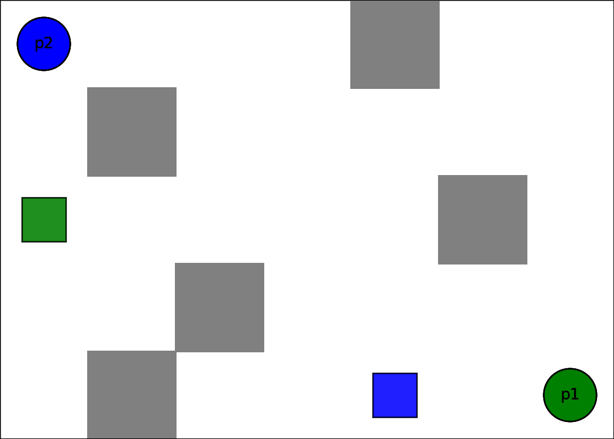

# Partially Observable Multi-Agent Path Finding via Answer Set Programming

<!--  -->
<!-- <video src='results/2_rooms.mp4' width=80/> -->


[](https://opensource.org/licenses/Apache-2.0)
[](https://arxiv.org/abs/2305.16203)
[](https://www.cs.utexas.edu/~vl/papers/wiasp.pdf)
[](https://potassco.org/clingo/)

### Intro

Multi-agent routing problems have drawn significant attention nowadays due to their broad industrial applications in, e.g., ware- house robots, logistics automation, and traffic control. Conventionally they are modelled as classical planning problems. In this work, we argue that it is beneficial to formulate them as ***universal planning*** problems. We therefore propose universal plans, also known as policies, as the solution concepts, and implement a system based on ***Answer Set Programming*** (ASP) for computing them. Given an arbitrary two-dimensional map and a profile of goals for a group of partially observable agents, the system translates the problem configuration to a logic program, and finds a feasible universal plan for each agent that ensures no collision with others.


### Conda Env & Dependence:

```shell
conda create -n mapf python=3.9.7
conda activate mapf
pip install -r requirements.txt
```


### Usage:

```shell
usage: run.py [-h] [--agents AGENTS [AGENTS ...]] [--map MAP] [--goals GOALS [GOALS ...]] [--lp-file LP_FILE] [--vis] [--save SAVE]

Partially Observable Multi-Agent Path Finding.

optional arguments:
  -h, --help            show this help message and exit
  --agents AGENTS [AGENTS ...]
                        Specify a team of agents
  --map MAP             Specify a map
  --goals GOALS [GOALS ...]
                        Specify the goals for each agent,e.g. 2_0 0_2
  --lp-file LP_FILE     Use an existing human-written lp file
  --vis                 Visulize the process
  --save SAVE           Specify the path to save the animation
```

Example:

```shell
python run.py --agents sensor_1 sensor_1 --map 3by3 --goals 3_2 3_3 --vis
```

The above command will instantiate two agents of sensor range 1 on a 3x3 map with the two specified goals, respectively. If a feasible universal plan exists, you will enter an interactive mode for inputting initial positions (locations separated with whitespaces), which resembles the following,

```shell
Logic program translated.
Solving time: 0.04840087890625
Policy saved as tmp.sol

Specify an initial position for agent p1: 1 1
Specify an initial position for agent p2: 2 2
```

Upon your input, it will generate a trajectory and render an animation,

```shell
STARTS:
{'p1': (1, 1), 'p2': (2, 2)}
-------------

[(1, 1), (2, 2)]
p1: ((1, 1), (2, 2)) -> nil
p2: ((2, 2), (1, 1)) -> left
	|
	V
[(1, 1), (2, 1)]
p1: ((1, 1), (2, 1)) -> right
p2: ((2, 1), (1, 1)) -> up

...

	|
	V
[(3, 2), (2, 3)]
p1: ((3, 2), (2, 3)) -> nil
p2: ((2, 3), (3, 2)) -> down
	|
	V
Goals reached!
```

Note that, the plan is called a ***universal*** one, as it supports all possible initial positions for the two agents (no re-computation will be needed). Thus, once an episode is over, the program will ask you to specify another set of initial positions.

One can also run an existing logic program that is complied before, considering some could be reuse for multiple times, by specifying the `--lp-file` option.


### Live Demo

Here is a demo animation, where 4 agents coordinate themselves with sensors of range 2. While agents are connected by a dotted line, it means one can observe the other.

https://github.com/user-attachments/assets/449c64e7-0c40-4b99-8d99-4c2af5992cd8


### Some Statistics

For users' reference, the following table shows the computing time for solving various scales.

| Map size   | 2 agents | 3 agents | 4 agents | 5 agents |
| ---------- | -------- | -------- | -------- | -------- |
| *Sensor 1* |          |          |          |          |
| 3 x 3      | 0.06s    | 3.23s    | 6.09min  | 8.76hr   |
| 4 X 4      | 0.29s    | 5.09min  | 28.40hr  | /        |
| 5 x 5      | 1.61s    | 40.24min | /        | /        |
| 6 x 6      | 11.69s   | 6.02hr   | /        | /        |
|            |          |          |          |          |
| *Sensor 2* |          |          |          |          |
| 3 x 3      | 0.06s    | 3.51s    | 8.86min  | 8.47hr   |
| 4 x 4      | 0.49s    | 2.22min  | 15.60hr  | /        |
| 5 x 5      | 2.30s    | 24.02min | /        | /        |
| 6 x 6      | 7.50s    | 4.14hr   | /        | /        |
|            |          |          |          |          |
| *Sensor 3* |          |          |          |          |
| 3 x 3      | 0.10s    | 3.37s    | 9.00min  | 8.92hr   |
| 4 x 4      | 0.39s    | 2.42min  | 18.69hr  | /        |
| 5 x 5      | 2.07s    | 26.71min | /        | /        |
| 6 x 6      | 7.54s    | 4.46hr   | /        | /        |

---

*Feel free to open any issue or pull-request. Have fun!*
